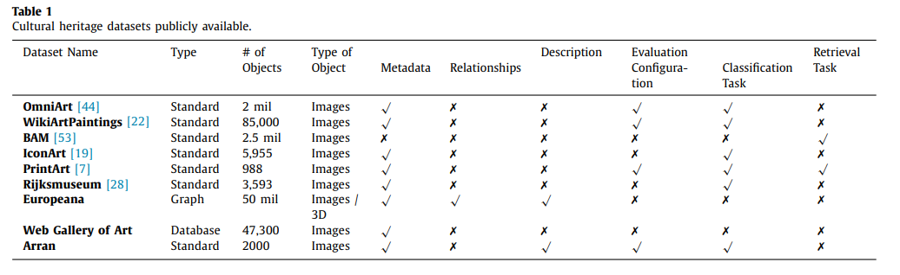
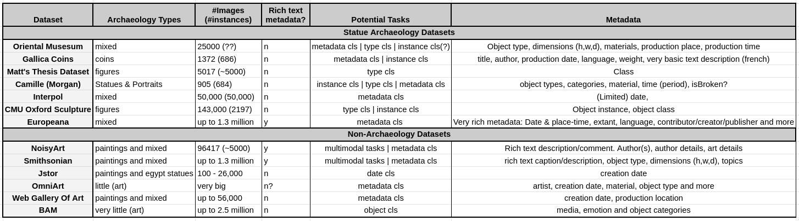
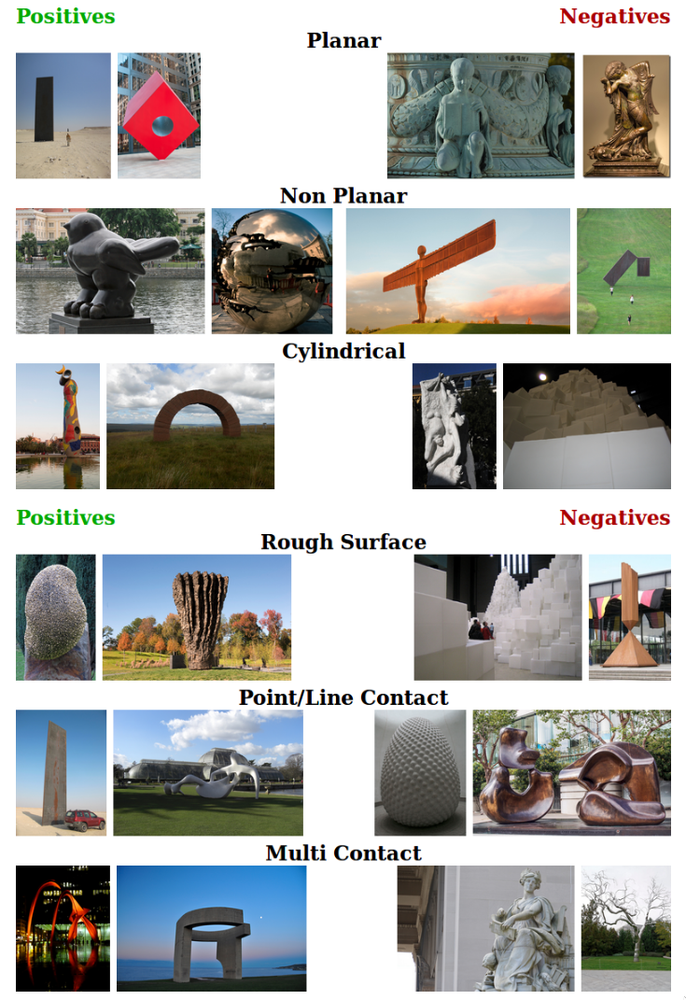
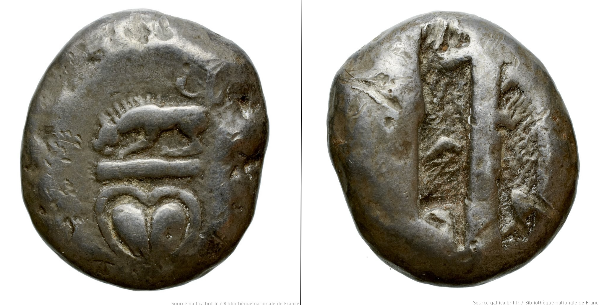
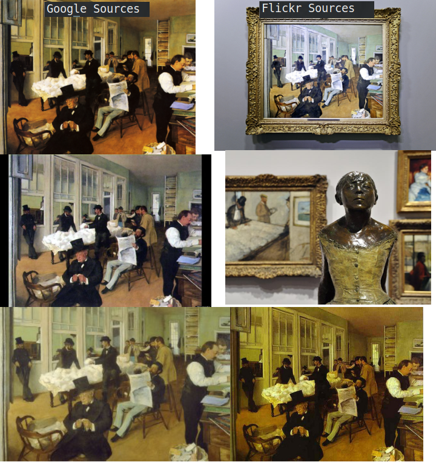
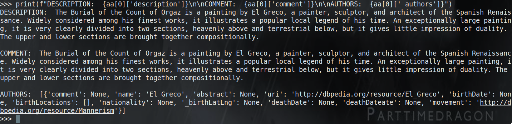

# Code Usage

# These instructions need updating!!
FOLLOW THESE INSTRUCTIONS TO RUN THIS CODE
1. ```git clone https://github.com/Jumperkables/archaeology```
2. Follow the sub-instructions to download ResNet rescaled
    * I cannot host this code directly on GitHub as i cannot confirm it is on the MiT License, and it would be a breach of copyright. I do not imply or recommend in any way that you host this publically available code yourself on any public platform.
    * Create the file ```models/resnet\_rescaled.py```
    * Put the following imports at the top of the file:
    ```
    import torch
    import timm
    import wandb
    import torchvision
    import pandas as pd
    import torch.nn as nn

    from torchvision import transforms
    from accelerate import Accelerator
    from tqdm import tqdm
    from timm.models.registry import register_model
    from timm.models.helpers import build_model_with_cfg
    from timm.models.resnet import Bottleneck, _create_resnet, default_cfgs, _cfg, make_blocks, create_classifier
    ```
    * From [this implementation](https://colab.research.google.com/drive/1RVOvZ7AkJuV8WNJwkXxxTtByEIXVV6CC?usp=sharing#scrollTo=bWioF_21jntW), copy the classes and functions ```ResNet```,```_create_resnet```, and all ```@register``` functions into ```models/resnet\_rescaled.py```
3. ```pip install -r requirements.txt```
4. ```mkdir data && cd data```
5. mkdir .results
6. mkdir .feats
5. Acquire the following datasets and put them in ```data``` with the accompanying names
    * Matthew's Thesis Data: TODO ```seedcorn-data```
    * Gallica Coin: TODO ```gallica_coin```
    * Morgan's Camille: TODO ```camille_durham```
6. Experiments
    * All experiments can be ran by bash scripts in the ```scripts/``` folder


# Archaeology Datasets
* A compilation of our available archaeological datasets
* A [2020 Survey Paper](papers/2020_ml_for_cultural_heritage_survery.pdf) has a nice visualisation on publically available datasets for cultural heritage: 




## Europeana
* Rich and diverse specifically "archaeology" dataset
* The archaeology section has up to 1.3 million usable images
* Very rich metadata
    - Contributor, creator, publisher
    - Date & `Place-time'
    - Extant
    - Language
    - More that i didn't think was relevant
[Source](https://www.europeana.eu/en/collections/topic/80-archaeology)

## CMU Oxford Sculpture (NoisyArt)
* 'data/cmu\_oxford\_sculpture'
* [Source](https://www.robots.ox.ac.uk/~vgg/data/sculptures/)
* Instance recongition for art datasets
* 143k images of 2197 works of art (242 artists)
* 12 labels for different 3D shape attributes


## Gallica Coins
* 'data/gallica\_coin'
* Search term "monnaeis cyrenaique"
* 686 instances of coins (2 images each)
* Text Data:
    - Title
    - Author i.e. this is important
    - Publication date, e.g.. 0500-0420 BC 
    - Language e.g. Greek
    - Weight
    - Very basic descrption: Example 'Collection numérique' and 'Monnaies grecques'
    - Source: Example 'Bibliothèque nationale de France, département Monnaies , médailles et antiques, K 3441 Provenance'
 


## Oriental Museum
**WE ONLY HAVE A PREVIEW SUPPLIED VIA E-MAIL. CAN GET THE REST LATER**
* 'data/Durham\_Oriental\_Museum Dataset\_preliminary'
* 20-30k images
* Images are statues (that i can see so far)
* Images of the same object from multiple views: e.g. front, below, above ....
* Sources (see Elizabeth's e-mail):
    - Durham Oriental Museum's ADLIB System
    - Transferred to PRIMO
    - IIIF
    - [Supplied link](http://iiif.durham.ac.uk/jalava/#index/Museum/Museum.OM/Museum.OM.1955) this supplied link contains A LOT of data
* Metadata (some images seem to lack this metadata, unclear how many):
    - Object Type: e.g. Ushabti (faience)
    - Dimensions (height, width, depth)
    - Materials  e.g. (combination inorganic/organic material - composite material - faience)
    - Production Place e.g. (Africa - North Africa - Egypt)
    - Production Period e.g. (3rd ntermediate period, late period, 26th dyansty, Unknown)
    - 


## Matt's Datasets
The various datasets Matt used in his thesis
To the best of my knowledge, the following DUMAC ections (up to and not including test sets 2 and 3) are broadly the same datasets?
* 'DUMAC Artefact Typologies'
    - 4381 Images 

* 'DUMAC v1 SixClasses\_InitialUnbalanced'
    - 4678 Images
    - 6 classes: Asia Figurines Anthro, Asia Figurines Zoo, Asia Vessel, Egypt Figurines Anthro, Egypt Figurines Zoo, Egypt Vessels

* 'DUMAC v2 SixClasses\_5000 Balanced'
    - 5017 Images
    - Same classes as above
    - Balanced somehow for train/val splits

* 'DUMAC Six Class v2\_9'
    - 5210 images
    - Split into train, validation and test splits
    - Same 6 classes

* DUMAC Test Set 2
    - Noisy real-world data (From OM)
    - Photos of objects in display cabinets from oriental museum
    - Lots of duplicate pictures

* DUMAC Test Set 3
    - Noisy real world data from bristol
    - Many duplicates

* Burst-shot OM
    - Multiple images moving very slowly around very few figurines
    - Bull Figure: 12 Objects (1259 images)
    - Tang Tomb: 5 objects (500 images)
    - Egypt Cat Figure: 3 objects (300 images)
    - Egypt Sitting Figure: 5 objects (478 images)
    - Egypt Standing Figure: 17 objects (1539 images) 

* Ebay Shabti Images
    - Very small set of shabti images from EBay (they are figurines)
    - 22 Direct pictures of products 
    - 22 screenshots of product pages

## Interpol Dataset
* 52140 (some off which arent shabti, mosaic etc..)
* Metadata (quite limited)
    - Date (curation or date recovered?)


## Camille
* 'data/camille\_durham'
* Dataset we received from Morgan
* Waiting for Morgan's response to describe the dataset to me


# Non Specifically Archaeology
Not specifically archaeology datasetes can still be useful. We can either:
* Find ways to search them for relevant data
* Broaden the task definition to include these datasets

## Smithsonian 
* 1.3 million images
* Metadata:
    - Full text caption
    - Full text descrption
    - Type i.e. object type
    - Dimensions
    - Topic i.e. vague categories the image is associated with
* [Source](https://www.smithsonianmag.com/smart-news/louvre-puts-entire-collection-online-redoubles-efforts-track-looted-art-180977367/)

## Jstor (Mixed dataset)
* [Source](https://www.jstor.org/site/artstor/)
* Egyptian and German Museum Subsets
* Under Between 100-26000
* Only metadata is creation date

## OmniArt
* [Source](http://www.vistory-omniart.com/#about)
* Lots of art (over 1GB of download links and text)
* Not exactly relevant to 

## NoisyArt
* 96417 images
    - Many images per class or instance
    - They seem to come from different source i.e. flickr, google
    - Google sources seem to be very very similar images with minor distortions
    - Flickr images seem to be almost unrelated at times, huge visual variety

* [Source](https://github.com/delchiaro/NoisyArt)
* Classes: Instance recongition dataset
* Metadata:
    - Comment: A very long and rich text description
    - Description: Another more specific rich text description
    - Museums its from
    - Title
    - Creation language / locations
    - Authors: Relatively detailed descriptions of authors


## Web Gallery of Art
* Up to 56000 images
* Requires the correct search term to be useful
* [Source](https://www.wga.hu/index1.html)
* Metadata (limited):
    - Name
    - Date of creation
    - Location of creation

## BAM (Behance Artistic Media Dataset)
* No archaeological data really
* [Source](https://bam-dataset.org/#explore)
* Up to 2.5 million images
* Clusters of artwork arranged by category to consider if the wider domain of artwork would ever be appropriate
